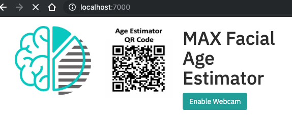

# Visual Recognition: Facial Age Estimator

This hands-on lab will use one of the models from the Model Asset Exchange (MAX), an exchange where developers can find and experiment with open source deep learning models. Specifically, we will be using the Facial Age Estimator to create a web application that will first detect human faces and then output the ages with the bounding boxes of the associated detected faces. The web application provides a user-friendly interface backed by a lightweight python server. The server takes webcam as input via the UI and sends them to a REST end point for the model. The model's REST endpoint is set up using the docker image provided on MAX. The Web UI displays the estimated age with the associated bounding box for each person.

* Check out a demo of the application here - https://developer.ibm.com/exchanges/models/all/max-facial-age-estimator/

## Prerequisites

The lab uses a TensorFlow & Keras based based Deep Learning model to perform multi-class classification and regression for age estimation. The input to the model is an image and the output is a list of estimated ages and bounding box coordinates of each face detected in the image. The format of the bounding box coordinates is [xmin, ymin, width, height]. Although this is a Deep Learning model, there is no requirement to be familiar with DL or the frameworks used, as the model is pre-built and pre-trained from the model exchange. There are two variants of the lab depending on what software you have on your machine and which type of user input you want to allow.

If you have a webcam and want to run the facial age estimator against the webcam feed, you will also need:

* Docker locally installed. If you also have Python installed, you can run the web app portion of the app directly in python.

If you do not have a webcam or prefer not to use it, you can run the facial age estimator against the a static image file (i.e. upload an image), you may also need:

* If you have Docker, you can run it locally using containers
* If you do not have docker, you can run this version fully remotely but will need a Docker ID.

## Instructions

To run the version that uses your webcam to capture live video and feed it to the age estimation model:

* Follow the [code pattern](https://developer.ibm.com/patterns/estimate-ages-for-detected-human-faces/) instructions found at this [Git repo]((https://github.com/IBM/MAX-Facial-Age-Estimator-Web-App/blob/master/README.md)) (https://github.com/IBM/MAX-Facial-Age-Estimator-Web-App/blob/master/README.md) to complete the lab.
* Follow the 'Run Locally' section of the README.
* When complete, you should see a user interface similar to this:
   

To run the version that uses a static image file and feed it to the age estimation model. Or if you do not have the pre-requisites installed locally (i.e docker):

* Follow the instruction found at this [Git repo]((https://github.com/jrtorres/MAX-Facial-Age-Estimator-Mini-Web-App)) (https://github.com/jrtorres/MAX-Facial-Age-Estimator-Mini-Web-App) to complete the lab.
* When complete, you should see a user interface similar to this:
   

## Call to Action

There are other deep learning models you can use/modify in the Model Asset eXchange. See more of them here - https://developer.ibm.com/exchanges/models/

If you want to explore visual recognition, without having to build/run the deep learning models. See the Watson Visual Recognition service here - https://www.ibm.com/watson/services/visual-recognition/ and various code patterns here - https://developer.ibm.com/?s=visual+recognition&orderby=date&order=DESC&post_type%5B%5D=ibmcode_patterns

Visual recognition based technology can help solve crisis arising from natural disasters. **Join the 2019 Call for Code challenge today!** -
https://developer.ibm.com/callforcode/

* Additional patterns can be found [here](https://developer.ibm.com/code-and-response/technologies/).

[Top](../README.md)

